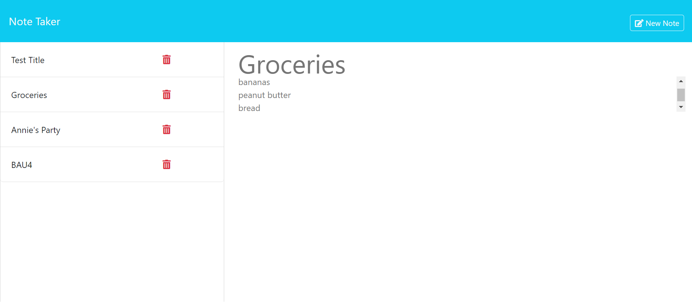

# Note-Taker

## Description
This webpage allows the user to create notes which are saved to a database and can be accessed at anytime when returning to the webpage. The user also has the option to delete notes by selecting the delete button on the page.

## Table of Contents
* [Description](#description)
* [Installation](#installation)
* [Usage](#usage)
* [License](#license)
* [Credits](#credits)

## Installation
No Installation is required to view this webpage. It can be accessed by visiting the following website: 

## Usage

When first visiting the site, select the "Get Started" button. This will lead to the notes page (refer to image above for reference). Once a note title and text has been entered in the corresponding areas, the options to save the note or clear the form appear on the top right of the page. Selecting clear form, clears the note title and text. If save is selected, the note title appears to the left of the page in a listed format, also with an option to delete.

## License
[License: MIT](https://opensource.org/licenses/MIT)

## Credits
https://gist.github.com/lukas-h/2a5d00690736b4c3a7ba

https://github.com/tchapi/markdown-cheatsheet/blob/master/README.md

https://developer.mozilla.org/en-US/docs/Web/JavaScript/Reference/Template_literals

https://www.geeksforgeeks.org/node-js-fs-writefilesync-method/?ref=lbp

## Contact
Github Repo - https://github.com/ceci-00/Verbalize
Email - ceci.ga003@gmail.com